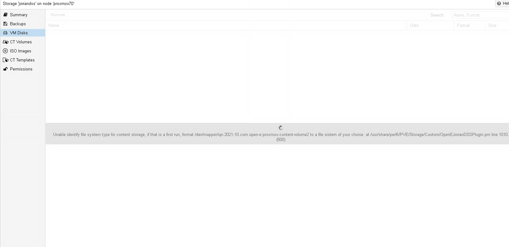

# JovianDSS-Proxmox

## Configuring

Enabling JovianDSS for `proxmox` require 2 configuration files.
First is a proxmox storage configuration file that gives basic information about storage.
And the second is a config used by a minimal joviandss cli `jdssc`.

### JovianDSS configuration

Prior to installation please ensure that services mentioned below are enabled on JovianDSS storage:
1. REST in `System Settings->Administration`


### Proxmox config

This config provides brief introduce Open-E JovianDSS plugin to proxmox storage sub-system.
And contains minimal set of information required by perl part to run.

`/etc/pve/storage.cfg` 

```
open-e: joviandss
        pool_name Pool-0
        config /etc/pve/joviandss.yaml
        path /mnt/joviandss
        content iso,backup,images,rootdir,vztmpl
        content_volume_name proxmox-content-volume-Pool-0
        content_volume_size 1
        debug 0
        multipath 1
```

| Option                     | Default value                     | Description                                                         |
|----------------------------|-----------------------------------|---------------------------------------------------------------------|
| `pool_name`                | Pool-0                            | Pool name that is going to be used. Must be created in \[1\]        |
| `config`                   | /etc/pve/joviandss.yaml           | path to `jdssc` configuration file                                  |
| `path`                     | None                              | Location that would be used to mount proxmox dedicated volume       |
| `content`                  | None                              | List content type that you expect JovianDSS to store                | 
|                            |                                   | Supported values: iso,backup,images,rootdir,vztmpl                  |
| `content_volume_name`	     | proxmox-content-volume-<Pool Name>| Dedicated volume that would be used to store content resources.     |
| `content_volume_size`      | 2                                 | Size of content volume, measured in Gigabytes                       |
| `debug`                    | 0                                 | Debuging flag, place 1 to enable                                    |
| `multipath`                | 1                                 | Multipath flag, place 1 to enable                                   |

[1] [Can be created by going to JovianDSS Web interface/Storage](https://www.open-e.com/site_media/download/documents/Open-E-JovianDSS-Advanced-Metro-High-Avability-Cluster-Step-by-Step-2rings.pdf)

Options `path`, `content`, `share_user` and `share_pass` are optional.
They are responsible for creation of a dedicated storage that gets attached to proxmox to store iso images and backups.
Specify this option in configuration file if you want to enable this dedicated storage.
Plugin will create it for you automatically.
If you want to change size of or modify this storage in other way, please find it in `Storage/Shares/proxmox-internal-data`.

### Jdssc config

This config file should be placed according to the path provided in `storage.cfg` file mentioned in the section above.
`joviandss.yaml` provides detailed information on interaction with storage.

```yaml
driver_use_ssl: True
target_prefix: 'iqn.2021-10.com.open-e:'
jovian_block_size: '64K'
jovian_rest_send_repeats: 3
san_api_port: 82
target_port: 3260
san_hosts: 
  - '172.16.0.220'
san_login: 'admin'
san_password: 'admin'
san_thin_provision: True
loglevel: debug
logfile: /tmp/jdss.log
```

| Option                     | Default value           | Description                                                         |
|----------------------------|-------------------------|---------------------------------------------------------------------|
| `driver_use_ssl`           | True                    | Use SSL to send requests to JovianDSS\[1\]                          |
| `iscsi_target_prefix`      | iqn.2021-10.com.open-e: | Prefix that will be used to form target name for volume             |
| `jovian_block_size`        | 64K                     | Block size of a new volume, can be: 32K, 64K, 128K, 256K, 512K, 1M  |
| `jovian_rest_send_repeats` | 3                       | Number of times that driver will try to send REST request           |
| `san_api_port`             | 82                      | Rest port according to the settings in \[1\]                        |
| `target_port`              | 3260                    | Port for iSCSI connections                                          |
| `volume_driver`            |                         | Location of the driver source code                                  |
| `san_hosts`                |                         | Yaml list of IP address of the JovianDSS                            |
| `san_login`                | admin                   | Must be set according to the settings in \[1\]                      |
| `san_password`             | admin                   | Jovian password \[1\], **should be changed** for security purposes  |
| `san_thin_provision`       | False                   | Using thin provisioning for new volumes                             |
| `loglevel`                 |                         | Logging level. Both `loglvl` and `logfile` have to be specified in order to make logging operational |
| `logfile`                  |                         | Path to file to store logs.                                         |


[1] Can be enabled by going to JovianDSS Web interface/System Settings/REST Access

[2] [Can be created by going to JovianDSS Web interface/Storage](https://www.open-e.com/site_media/download/documents/Open-E-JovianDSS-Advanced-Metro-High-Avability-Cluster-Step-by-Step-2rings.pdf)

[More info about Open-E JovianDSS](http://blog.open-e.com/?s=how+to)

## Multipathing

In order to enable multipathing user should modify proxmox `storage.cfg`, file specified as `config` in `storage.cfg` responding for connectivity options with joviandss `joviandss.yaml` and proxmox multipath service itself.


### Joviandss.yaml

Provide list of ip's that would be used for multipathing in `san_hosts` property.

### Proxmox multipathing configuration

Make sure that multipath service is present 

```bash
apt install multipath-toolsa  sg3-utils
```

Provide necessary configuration to multipath service in `multipath.conf` file at /etc/multipath/conf.d/multipath.conf.
This config is based on [proxmox recomendations](https://pve.proxmox.com/wiki/ISCSI_Multipath)

```bash
defaults {
        polling_interval        2
        path_selector           "round-robin 0"
        path_grouping_policy    multibus
        uid_attribute           ID_SERIAL
        rr_min_io               100
        failback                immediate
        no_path_retry           queue
        user_friendly_names     yes
        config_dir              /etc/multipath/conf.d
}

blacklist {
        wwid .*
        devnode "^(ram|raw|loop|fd|md|dm-|sr|scd|st)[0-9]*"
}

multipaths {
}

blacklist_exceptions {
}
```

Please make sure that your `multipath.conf` contain sections `multipaths`, `blacklist_exceptions` and `user_friendly_name` is ON.

Multipath config might be edited by JovianDSS plugin, please do not edit blocks within comment sections:
```bash
# Start of JovianDSS managed block
        ...
# End of JovianDSS managed block
```  

```bash
defaults {
        polling_interval        2
        path_selector           "round-robin 0"
        path_grouping_policy    multibus
        uid_attribute           ID_SERIAL
        rr_min_io               100
        failback                immediate
        no_path_retry           queue
        user_friendly_names     yes
        config_dir              /etc/multipath/conf.d
}

blacklist {
        wwid .*
        devnode "^(ram|raw|loop|fd|md|dm-|sr|scd|st)[0-9]*"
}

multipaths {
# Start of JovianDSS managed block
      multipath {
            wwid 26431316533316430
            alias iqn.2021-10.com.open-e:proxmox-content-volume-Pool-0
      }
      multipath {
            wwid 23939646637633635
            alias iqn.2022-10.com.open-e:proxmox-content-volume-Pool-1
      }
# End of JovianDSS managed block
}

blacklist_exceptions {
# Start of JovianDSS managed block
      wwid 26431316533316430
      wwid 23939646637633635
# End of JovianDSS managed block
}
```

Ensure multipath is up and running
```bash
systemctl enable multipathd
systemctl start multipathd
```

### Storage.cfg
Activate feature by setting `1` for `multipath` property in `storage.cfg` 

### Content volume

If `content` being set in `storage.cfg` JovianDSS Proxmox plugin will try to use volume specified as `content_volume_name` in `storage.conf` as a storage for
data described in `content` variable.
User can create volume `content_volume_name` manually or let JovianDSS plugin create it automatically.
After activation plugin will try to mount content volume to directory specified as `path` in `storage.conf` file.
If volume was not formatted administrator is expected to format it manually.

Plugin will show path of device representation is OS through error message in web interface 

Or in command line:
```bash
pvesm list joviandss
```

Will output address `/dev/mapper/iqn.2021-10.com.open-e:proxmox-content-volume-Pool-0` for volume `proxmox-content-volume-Pool-0`.
```bash
Unable identify file system type for content storage, if that is a first run, format /dev/mapper/iqn.2021-10.com.open-e:proxmox-content-volume-Pool-0 to a file system of your choise. at /usr/share/perl5/PVE/Storage/Custom/OpenEJovianDSSPlugin.pm line 1010.
```

Formatting can be done by calling

```bash
mkfs.ext3 /dev/mapper/iqn.2021-10.com.open-e:proxmox-content-volume-Pool-0
```

## Installing/Uninstalling

Installation can be done by `make` inside source code folder

```bash
make install
```

Removing proxmox plugin with `jdssc`
```bash
make uninstall
```

Or by installing it from debian package

```bash
apt install ./open-e-joviandss-proxmox-plugin_0.9.5-1.deb
```

Once installation is done, provide configuration.

After installation and configuration restart proxmox server.

```bash
reboot
```
### Clustering

Plugin have to be installed and configured on all nodes in cluster.


## Supported features

- [x] Create volume
- [x] Delete volume
- [x] Create snapshot
- [x] Delete snapshot
- [x] Restore snapshot
- [x] Create template
- [x] Delete template
- [x] ISO support
- [x] Backup volume
- [x] Container support
